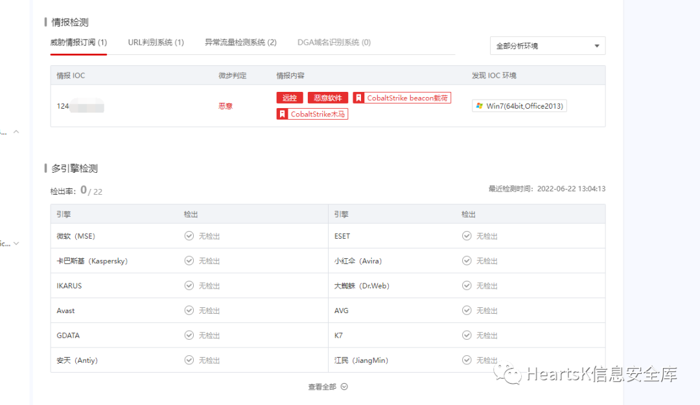

# ::ZheTian / 遮天 Powerful Anti Anti-Virus Trojan horse generator / 强大的Anti-Virus对抗工具

----

## 我们秉承着学习研究的精神提供红蓝对抗思路及工具实现。
### 遮天共更新了三个版本各有其优势，区别：

> ### 1.x： 支持远程加载、账户创建、输出程序
>
> ### 2.x： Bypass all（需修改下代码里的敏感特征）、可生成指定架构程序
>
> ### 3.x： 新增Bypass UAC、用户创建、智能反沙箱（BUG已修复）

## 项目请移步至v1、v2、v3目录

## 效果：仅能检测到流量特征，Bypass All Anti-Virus.
### 动态免杀请替换默认证书，使用SSL加密流量即可。

## 扩展：Windows defender

### 以超级用户身份执行下面命令会分别向Windows Defender添加白名单：信任目录、信任进程、信任类型文件

> ### powershell -Command Add-MpPreference -ExclusionPath "C:\tmp"
>
> ### powershell -Command Add-MpPreference -ExclusionProcess "java.exe"
>
> ### powershell -Command Add-MpPreference -ExclusionExtension ".java"
>

----

## QQ安全研究群：

### [点击加入：528118163](https://jq.qq.com/?_wv=1027&k=azWZhmSy)

## 加群 / 联系（左） |  公众号：遮天实验室（右）

