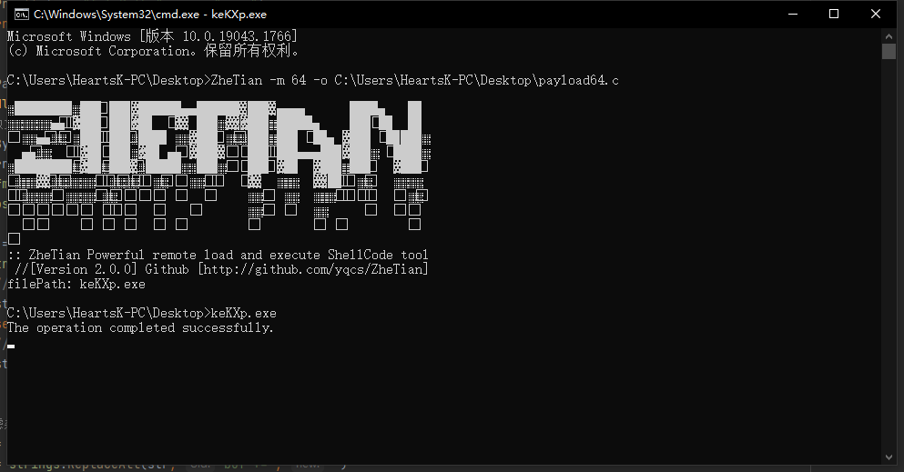

# 遮天 2.x

### 全新V2上线，Bypass All（releases已歇菜，改改代码重新生成还能用）.

#### V2版本支持Cobalt Strike、MSF原生Shellcode，无需任何处理即可直接使用，指令：

> -o string：选中payload，向同级目录生成一个可执行程序（无需go语言环境）
>
> -m int：选择要生成的系统架构，参数选择32和64，默认选中了64
>
系统依旧采用了“慢加载”方式，运行约十五秒后才开始执行上线操作

####  此版本采用 ~~闭源~~（已开源） 更新。相比较移除了原本的ShellCode loader功能，只保留了生成模块。此版本进行功能优化之后可能成为最终解决方案，但是免杀之路不会停止，ZheTian后续版本将与[Hearts K](http://heartsk.com/) 继续保持独立，欢迎继续体验新项目！感谢各位师傅一路关注。 —— 遮天项目

----
## 效果：
### 除了流量特征，动静态 bypass all.

### 2.x原理解析： https://mp.weixin.qq.com/s/h7wP-1e0uoJKxKVNLeEw1Q
